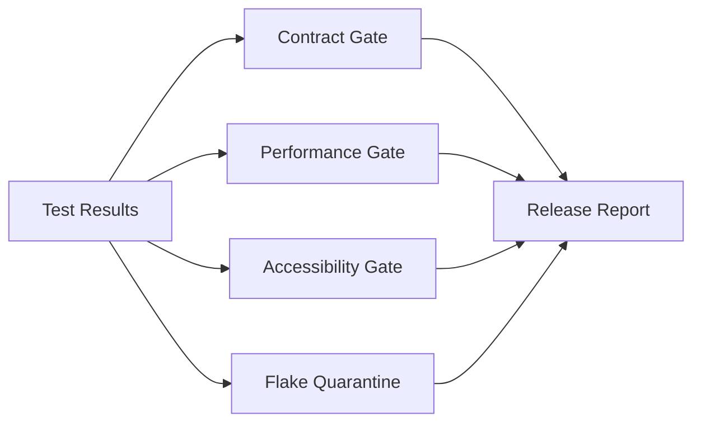

# QA Autopilot Quality Gates

[](https://github.com/Shubh0808/qa-autopilot-quality-gates/actions/workflows/ci.yml)


An advanced quality engineering project that turns test signals into release
decisions. It combines API contract checks, performance budgets, accessibility
hints, flaky-test quarantine, and JSON/JUnit-style reporting.

## Capabilities

- Validates API responses against a minimal OpenAPI-like contract.
- Scores performance budgets using p95 latency and error rate.
- Detects common accessibility issues in generated HTML.
- Quarantines flaky tests based on historical pass/fail windows.
- Produces a release gate summary that can block CI.

## Run

```bash
npm test
node src/cli.js examples/run.json
```

## Architecture



## Portfolio talking points

This repository shows testing beyond unit tests: release governance, quality
signals, CI ergonomics, and maintainable gate logic.
